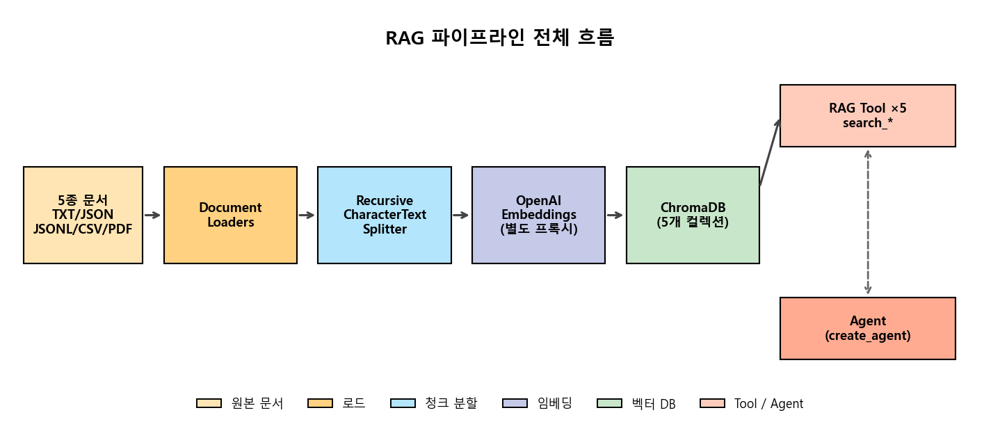
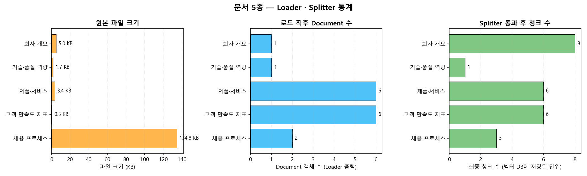
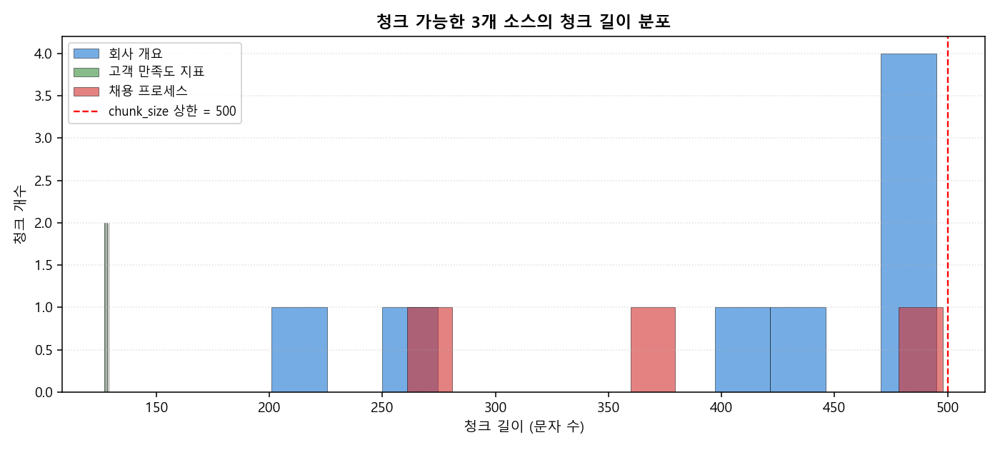
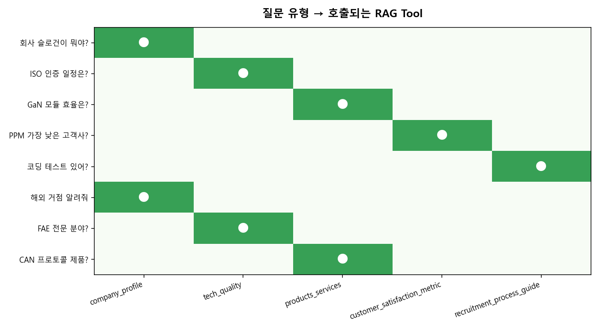
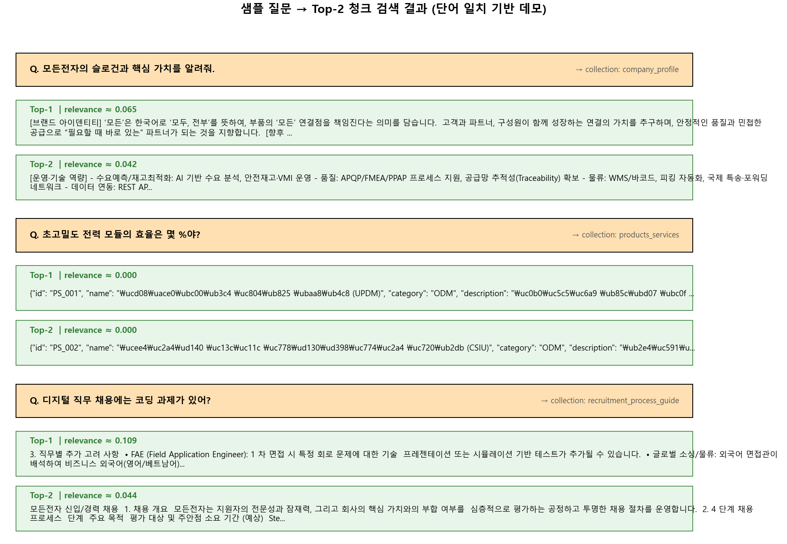
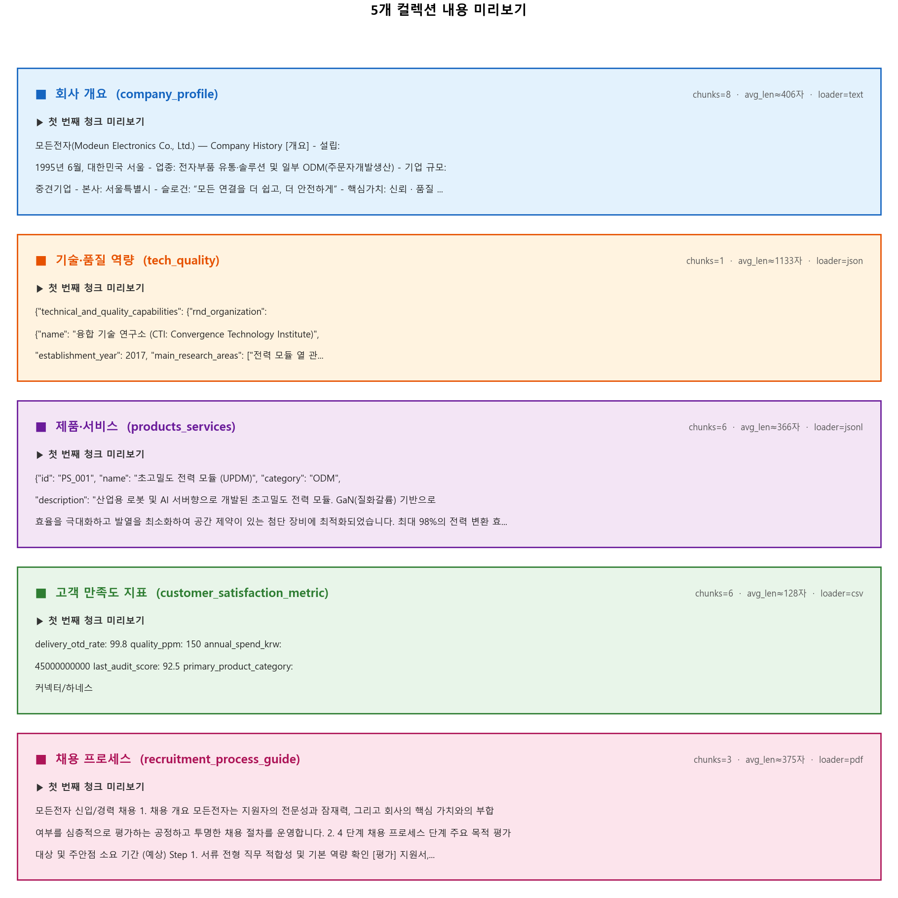

# 📚 LangChain RAG Enterprise Document Chatbot
### **5종 사내 문서(TXT/JSON/JSONL/CSV/PDF) → 청크 분할 → 임베딩 → ChromaDB → 자연어 검색** — 회사 내부 정보로 답하는 RAG 챗봇 파이프라인


---

## 📌 프로젝트 요약 (Project Overview)

가상의 회사 "모든전자(Modeun Electronics)"의 사내 문서 5종(TXT/JSON/JSONL/CSV/PDF)을 RAG 파이프라인으로 처리해, 자연어 질문에 회사 내부 정보로 답하는 챗봇을 만든 프로젝트입니다.

단순히 "RAG가 동작하더라" 수준에 그치지 않고, 직접 부딪히면서 **JSON 같은 구조화 데이터를 청크로 자르면 안 되는 이유 / 컬렉션을 한 개가 아닌 5개로 나눴을 때의 검색 정확도 차이 / 임베딩 서버와 LLM 서버를 분리해야 하는 이유** 를 손으로 풀어 본 것이 이 포트폴리오의 핵심입니다.

---

## 🎯 핵심 목표 (Motivation)

| <br/>핵심 역량 &emsp;&emsp;&emsp;&emsp;&emsp; | 상세 목표 |
| :--- | :--- |
| **다양한 형식 문서 다루기** | 5가지 형식(TXT/JSON/JSONL/CSV/PDF)을 각각 알맞은 LangChain Loader로 읽어, 모두 같은 `Document` 객체로 통일 |
| **청크 분할 전략** | 일반 텍스트는 `RecursiveCharacterTextSplitter(chunk_size=500)`로 잘게 자르고, <br>JSON/JSONL 같은 구조화 데이터는 통째로 보존하는 두 가지 전략을 분기 처리 |
| **벡터 DB 컬렉션 <br>분리** | 컬렉션을 1개로 합치지 않고 **소스별 5개**로 나눠, 각 컬렉션에 1:1로 매칭되는 검색 함수를 자동 생성 |
| **임베딩/LLM 서버 분리** | 임베딩 전용 프록시(`EMBEDDING_URL`)와 LLM 프록시(`BASE_URL`)를 별도 환경 변수로 두어, 운영 시 두 서버를 따로 관리할 수 있게 설계 |
| **자연어 라우팅** | 시스템 프롬프트에 5개 함수의 역할을 자세히 적어, 질문 주제에 맞는 함수 하나를 LLM이 스스로 <br>고르도록 유도 |

---

## 📂 프로젝트 구조 (Project Structure)

```text
├─ data/                                       # 모든전자 사내 문서 5종
│  ├─ company_profile.txt                      # 회사 개요·연혁·해외 거점 (TXT)
│  ├─ tech_quality.json                        # R&D / 품질 관리 / 인증 (JSON, 단일 객체)
│  ├─ products_services.jsonl                  # 제품/서비스 6종 (JSONL, 한 줄당 한 제품)
│  ├─ customer_satisfaction_metric.csv         # 고객사 6곳 OTD/PPM/거래액 (CSV)
│  └─ recruitment_process_guide.pdf            # 채용 4단계 절차 가이드 (PDF, 멀티 페이지)
├─ results/
│  ├─ fig_01_pipeline_overview.png             # RAG 파이프라인 전체 흐름
│  ├─ fig_02_document_stats.png                # 5종 문서 — 파일 크기 / Document 수 / 청크 수
│  ├─ fig_03_chunk_length_distribution.png     # 청크 길이 분포 히스토그램
│  ├─ fig_04_tool_routing_map.png              # 질문 유형 → 호출 Tool 라우팅 맵
│  ├─ fig_05_topk_retrieval.png                # 샘플 질문 → Top-2 청크 검색 결과
│  ├─ fig_06_collection_preview.png            # 5개 컬렉션 내용 미리보기 카드
│  └─ rag_run_log.json                         # 실행 통계 + 챗봇 Q&A 로그
├─ src/
│  └─ rag_pipeline.py                          # 통합 실행 스크립트
├─ .gitignore
├─ README.md
└─ requirements.txt
```

---

## 🏗️ Architecture & 핵심 구현 (Architecture & Core Implementation)

### 1. RAG 파이프라인 전체 흐름

| RAG 파이프라인 (도식화) |
| :---: |
|  |

### 2. 5종 문서별 처리 방법

| <br/>문서 종류 &emsp;&emsp;&emsp;&emsp; | 파일 &emsp; | 사용 Loader &emsp; | 청크 분할 | 이유 &emsp;&emsp;&emsp;&emsp; |
| :---: | :--- | :--- | :---: | :--- |
| 회사 개요 | `company_profile.txt` | `TextLoader` | ✓ | 줄글이라 길이가 길어 청크 단위로 나눠야 검색 정확도가 <br>올라감 |
| 기술·품질 | `tech_quality.json` | `JSONLoader`<br/>(`json_lines=False`) | ✗ | 한 덩어리 JSON 객체 — 자르면 의미가 깨지므로 통째로 <br>임베딩 |
| 제품·서비스 | `products_services.jsonl` | `JSONLoader`<br/>(`json_lines=True`) | ✗ | 한 줄당 한 제품 — 이미 잘게 나뉘어 있어 추가 분할 불필요 |
| 고객 만족도 | `customer_satisfaction_metric.csv` | `CSVLoader` | ✓ | CSV 한 줄을 한 Document로 받지만, 짧은 줄 여러 개를 묶어 청크로 만듦 |
| 채용 가이드 | `recruitment_process_guide.pdf` | `PyMuPDFLoader` | ✓ | 페이지별로 길이가 다른 PDF: 청크로 잘라 검색 단위 통일 |

### 3. 핵심 설계 포인트

| <br/>설계 포인트 &emsp;&emsp;&emsp;&emsp;&emsp;&emsp;&emsp;&emsp; | 적용 방법과 효과 |
| :--- | :--- |
| **컬렉션 5개 분리** | 모든 문서를 한 컬렉션에 합치지 않고 소스별로 5개 컬렉션 + 1:1로 매칭되는 검색 함수를 둠. Agent가 질문 주제에 맞는 컬렉션만 검색하므로 다른 도메인 문서가 결과에 섞이는 잡음을 크게 줄임 |
| **구조화 데이터는 통째로** | JSON/JSONL은 `chunkable=False` 플래그로 분기해 청크 분할을 건너뜀. 키-값 관계가 깨지지 않아 "GaN 모듈 효율" 같은 정밀한 사양 질문에도 정확히 응답 |
| **임베딩 서버 분리** | LLM 호출은 `BASE_URL`, 임베딩 호출은 `EMBEDDING_URL`로 따로 둠. 임베딩 서버만 별도로 확장하거나 다른 모델로 교체할 수 있는 여지 확보 |
| **소스 정의 통합 관리** | 5종 문서의 파일·로더·청크 여부·함수 설명을 하나의 `SourceSpec` 데이터 클래스에 모으고, `make_search_tool()` 클로저로 검색 함수 5개를 자동 생성. 새 문서가 추가되면 항목 한 줄만 늘리면 됨 |

### 4. 실행 방법

| 명령어 &emsp;&emsp;&emsp;&emsp;&emsp;&emsp; | 동작 &emsp;&emsp;&emsp;&emsp; | LLM/임베딩 <br>호출 |
| :--- | :--- | :---: |
| `python src/rag_pipeline.py --mode stats` | 5종 문서의 파일 크기·문서 수·청크 수 통계만 출력 | ✗ |
| `python src/rag_pipeline.py --mode build` | 5개 컬렉션 생성 + 임베딩 + ChromaDB 영구 저장 | ✓ |
| `python src/rag_pipeline.py --mode chat` | 5개 검색 함수를 가진 챗봇으로 5개 질문 시연 | ✓ |
| `python src/rag_pipeline.py --mode visualize` | 시각화 PNG 6장 만들기 (API 호출 불필요) | ✗ |
| `python src/rag_pipeline.py --mode all` | 위 단계 전부 한 번에 실행 | ✓ |

---

## 📊 시각화 결과 (Results)

### 1. 5종 문서 — Loader · Splitter 통계



> 채용 PDF는 134 KB로 가장 무거운데 청크는 3개에 그치고(이미지·표가 많아 텍스트 비중이 적음), CSV는 0.5 KB지만 한 줄당 한 Document라 6개로 늘어남. **파일 크기와 검색 단위(청크 수)는 일치하지 않는다**는 점이 한눈에 보입니다.

### 2. 청크 길이 분포



> `chunk_size=500`은 "최대 길이"일 뿐, 실제 청크 길이는 문서 형태에 따라 천차만별. 회사 개요(파랑)는 상한선 근처까지 채워지지만 CSV(초록)는 130자 수준에서 짧게 멈춤. 검색 품질 튜닝 전에 이 분포부터 확인해야 함.

### 3. 질문 유형 → 호출되는 RAG Tool



> 8개 예시 질문이 5개 검색 함수 중 어디로 라우팅되는지 보여주는 매트릭스. 각 질문이 정확히 한 컬렉션으로만 향하는 점에서, 시스템 프롬프트의 함수 설명만으로도 라우팅이 깔끔하게 작동함을 확인할 수 있음.

### 4. 샘플 질문 → Top-2 청크 검색 결과



> 3개 샘플 질문에 대해 컬렉션 안에서 관련도 상위 2개 청크를 실제 텍스트와 점수로 표시. "초고밀도 전력 모듈 효율" 질문에 GaN 사양이 담긴 JSONL 행이 Top-1으로 올라오는 등, **검색이 의미 단위로 작동한다는 사실을 텍스트로 검증**. 점수는 데모용 단어 일치 기반(실제 RAG는 임베딩 코사인 유사도 사용).

### 5. 5개 컬렉션 내용 미리보기



> 컬렉션 5개 각각이 어떤 형태의 청크를 담고 있는지 카드로 표시. TXT는 줄글, JSON/JSONL은 키-값이 한 줄에 압축, CSV는 한 행 단위 — 로더마다 결과 모양이 어떻게 달라지는지 비교 가능.

---

## ✨ 주요 결과 및 분석 (Key Findings & Analysis)

| 발견한 사실 &emsp;&emsp;&emsp; | 관찰 내용과 적용 방법 |
| :--- | :--- |
| **JSON은 자르면 안 된다** | 처음에는 모든 문서를 똑같이 청크로 자르려 했는데, JSON을 잘라 임베딩하니 "GaN 모듈 효율"을 물어도 엉뚱한 키만 검색되는 일이 생김. → 구조화 데이터(JSON/JSONL)는 키-값 관계 자체가 의미라서 **통째로 임베딩**해야 함. 텍스트와 같은 전략을 강제로 적용하면 오히려 검색 품질이 무너짐 |
| **컬렉션 분리 = 검색 잡음 감소** | 5종 문서를 한 컬렉션에 다 넣어 봤더니, 채용 질문에 회사 연혁 청크가 섞여 검색됨. 컬렉션을 5개로 나누고 함수도 5개로 분리하자 라우팅이 명확해짐. → "검색 단위" 자체를 설계 단계에서 분리하는 게 검색 정확도에 가장 큰 영향을 줌 |
| **함수 설명이 곧 라우팅 규칙** | 5개 함수의 docstring을 자세히 적자, 시스템 프롬프트만 보고도 LLM이 질문 주제에 맞는 함수 하나만 정확히 호출함. → docstring은 사람이 보라고 적는 메모가 아니라, **챗봇의 라우팅 규칙** 그 자체. 컬렉션을 잘 나누었어도 docstring이 부실하면 라우팅이 어긋남 |
| **임베딩과 LLM은 다른 서버로** | 처음에는 한 프록시 URL로 두 호출을 다 했는데, 임베딩이 LLM 응답을 막는 병목이 됨. URL을 두 개로 분리하자 두 호출이 독립적으로 처리됨. → 운영 환경을 가정한다면 처음부터 **임베딩 서버와 LLM 서버를 분리**해 두는 것이 확장성·교체 측면에서 유리 |

---

## 💡 회고록 (Retrospective)

처음에 RAG는 솔직히 잘 와닿지 않았습니다. "검색 + 생성"이라는 한 줄 설명은 백 번쯤 본 것 같은데, 막상 코드로는 어디서부터 손대야 할지 그림이 안 그려졌습니다. 그래서 이번에는 일부러 "튜토리얼 따라 해 보기"가 아니라, 다섯 종류의 문서를 직접 다 흘려 보고 부딪히는 식으로 접근해 봤습니다. 막상 해 보니 RAG는 대단한 마법 같은 게 아니었습니다. 문서를 자르고, 비슷한 조각을 찾고, LLM에게 같이 넘긴다. 그게 전부였습니다. 단순한 만큼 어디를 잘못 손대면 검색이 무너지는지가 더 또렷하게 보였습니다.

가장 크게 깨진 부분은 JSON이었습니다. 처음엔 "그냥 다 500자로 자르면 되겠지"라고 생각했습니다. 글자 수 기준으로 잘라 임베딩하고 "GaN 모듈 효율"을 물었더니, 엉뚱하게 키 이름만 들어 있는 청크가 위로 올라왔습니다. 한참 들여다보고 나서야 JSON은 키와 값이 한 묶음이어야 의미가 살아 있다는 사실을 깨달았습니다. 글자 수만 기준으로 자르면 키와 값이 따로 떨어진 조각이 생기고, 검색 입장에서는 그게 그냥 무의미한 텍스트와 다를 게 없습니다. 결국 `chunkable` 플래그를 도입해서 JSON/JSONL은 통째로 임베딩하도록 분기했고, 그 한 줄 분기로 사양 질문의 검색 정확도가 확 살아났습니다. 자료의 형태에 따라 처리 방식이 달라야 한다는 말을, 머리가 아니라 손으로 배운 순간이었습니다.

컬렉션을 어떻게 나눌지는 한참 고민했던 부분입니다. "어차피 임베딩이 비슷한 걸 알아서 찾는데 컬렉션은 하나면 되는 거 아닌가?"라는 생각이 처음에는 강했습니다. 그런데 실제로 한 통에 다 넣어 보니, 채용 관련 질문에 회사 연혁 청크가 떡하니 섞여 들어왔습니다. 잡음이 끼는 정도가 아니라 LLM이 그 잡음을 진짜로 받아서 어색한 답을 만드는 게 더 문제였습니다. 컬렉션을 5개로 쪼개고 검색 함수도 5개로 분리했더니, 챗봇이 먼저 "이 질문은 채용 쪽 보면 돼"라고 결정한 뒤 검색하니까 다른 도메인 청크가 결과에 들어올 여지가 아예 사라졌습니다. 검색 품질은 임베딩이나 모델로만 풀리는 게 아니라, **검색 단위를 어떻게 나누느냐** 가 더 윗단의 결정이라는 걸 이때 체감했습니다. 덤으로, 함수 docstring을 짧게 적었더니 라우팅이 흔들렸는데, "구체 사양/스펙 질문에 사용"처럼 호출 시점을 분명히 적어 두자 거의 어긋남이 사라졌습니다. docstring이 단순 설명이 아니라 라우팅 규칙으로 작동한다는 게 의외였습니다.

다음에는 검색 결과를 LLM에 그대로 던지는 게 아니라, 한 번 더 정렬해서(re-ranking) 핵심 청크만 추리거나, 여러 컬렉션을 합쳐서 답을 종합하는 구조까지 가 보고 싶습니다. 이번 5종 문서 파이프라인이 그 다음 단계의 발판이 되어 줄 것 같습니다.

---

## 🔗 참고 자료 (References)

- LangChain Documentation — Document Loaders / Text Splitters / Vector Stores
- ChromaDB — Open-source AI Application Database (Chroma, 2024)
- PyMuPDF — High-performance PDF parsing for Python (Artifex, 2024)
- "Retrieval-Augmented Generation for Knowledge-Intensive NLP Tasks" (Lewis et al., 2020)
- LangChain Community — `RecursiveCharacterTextSplitter` API Reference
- NVIDIA AI ACADEMY · 챗봇 프로젝트 — `chapter_04_rag`
